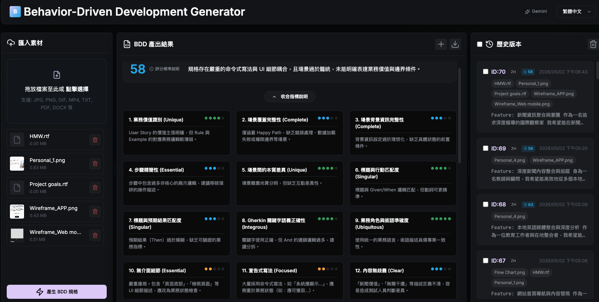

# Behavior-Driven Development Generator
這是一個基於 AI 的行為驅動開發 (BDD) 規格生成工具，採用優雅的 Lavender 線性風格設計。支援從圖片、文件與影片素材自動產出高品質的 Gherkin 規格，並提供專業的品質診斷分析。

## 核心功能
- **AI 規格生成**：支援多種素材格式 (PDF, PNG, JPG, TXT, MP4)。
- **專業品質診斷**：基於 1-5 分 Likert 量表的專家級 BDD 品質評估。
- **線性風格設計**：深色模式優化，高對比薰衣草紫視覺系統。
- **版本管理**：支援歷史版本預覽與對照分析。

## 介面預覽

訪問 `https://bdd-qa-assessment2605.onrender.com/` 即可開始使用。
